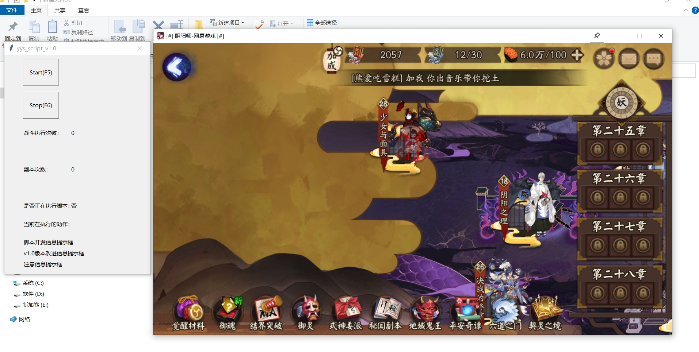
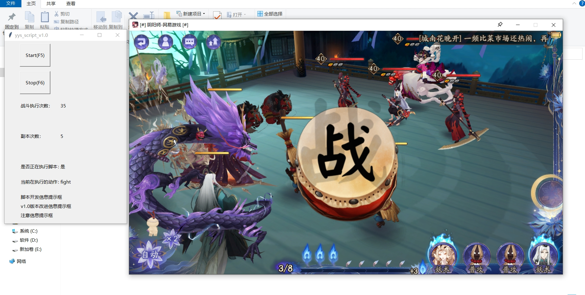

## 阴阳师桌面版困28脚本

### 基于python-opencv图片匹配，pyautogui鼠标模拟

## 一、准备工作

1.1隔离沙箱（推荐sandboxie-plus）

1.2阴阳师桌面版

1.3下载项目

## 二、运行

桌面分辨率1920x1080 打开隔离沙箱，在沙箱中打开阴阳师桌面版（窗口默认大小），放在桌面不能遮挡

### 2.1需要源码

```
conda create -n yys_k28_script python=3.9
```

```
conda activate yys_k28_script 
```

```
pip install -r requirements.txt -i https://pypi.tuna.tsinghua.edu.cn/simple
```

### 2.2不需要源码

双击yys_k28_script.exe

进入如下界面，F5运行，F6停止



运行界面


